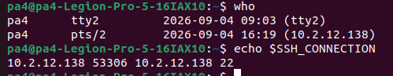
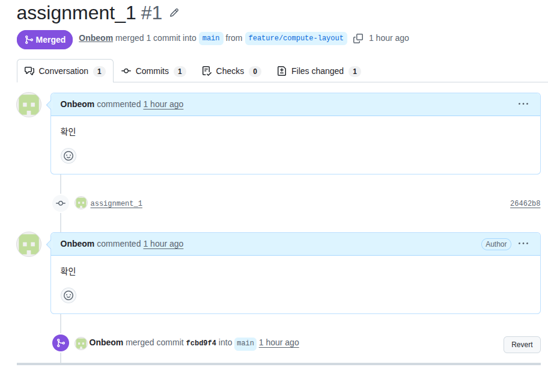

# 1. 배달 로봇의 연산 분담과 실시간성 설계

## 전제 조건 : 배달 로봇에 다음이 실려 있다고 가정합니다 — 2D 라이다(15Hz), RGB 카메라(60fps·720p), IMU(400Hz), 바퀴 엔코더(2kHz), 모터 드라이버, LTE 모듈(핑 1~5ms, 업로드/다운로드 95~100Mbps)

## 1. 이 로봇이 하는 작업 여섯 가지(모터 속도 제어, 장애물 감지, 보행자 인식, 지도 기반 경로 계획, 배달 완료 사진 업로드, 운행 로그 집계)를 임베디드 / Edge AI / 클라우드 중 어디서 처리할지 표로 배치하고, 지연 예산과 데이터 전송량을 근거로 각각 이유를 쓰세요(1강).

### **연산 분담 배치표**

|작업|위치|지연 예산|데이터량|근거|
|---|---|-------|------|---|
|모터 속도 제어|임베디드|≤ 1 ms|엔코더 16 KB/s + 명령 수 B/ms|LTE통신과 엣지의 주기가 지연 예산보다 크기에 불가능하고 데이터는 작지만 짧은 주기가 필요하므로 MCU의 타이머 인터럽트에서 PID 제어|
|장애물 감지|임베디드+Edge AI|≤ 66.6 ms|라이다 43.2 KB/s|점 스캔의 계산은 임베디드와 엣지 모두 가능하므로 둘다 사용하여 비상 정지와 같은 급작스러운 상황이나 최종 판정은 mcu가 바로 전달하여 엣지가 죽어도 작동하도록 하며, 지도의 경로 계획과의 결합을 위해 기본적인 연산은 엣지가 진행|
|보행자 인식|Edge AI|≤ 16.6 ms|165.9 MB/s|초당 요구 데이터량이 LTE의 속도보다 많기에 클라우드에서는 불가능하기에 엣지 AI로 계산 후 결과만 판단으로 넘김|
|지도 기반 경로 계획|Edge AI+클라우드|1 ~ 5 s|요청 수백 B, 응답 waypoint 수 KB|지도는 수 GB이고 도로 통제·다른 로봇 위치와 함께 갱신되므로 클라우드 서버 이용, 응답이 몇 초 늦어도 로봇은 이전 경로로 계속 주행할 수 있어 지연에 둔감. 국소 회피는 엣지에서 진행|
|배달 완료 사진 업로드|클라우드|초 ~ 분|JPEG 1 장 ≈ 0.5~2 MB, 배달 1 건당 1 회|실시간성이 전혀 없기에 클라우드 서버 이용|
|운행 로그 집계|클라우드|분 ~ 시간|로그 수십 KB/s 를 로컬 축적, 압축 후 업로드| 마감이 없기에 로컬 저장 후 Wi-Fi/유휴 시간 배치 업로드|

## 2. 카메라 원시 영상을 클라우드로 계속 보내면 초당 몇 MB 인지 계산하고, LTE 대역폭과 비교해 그 설계가 왜 성립하지 않는지 수치로 보이세요.

### **카메라 원시 영상 전송량**

#### `1327.1` MB/s — LTE 대비 판단: `13배 이상 큼 -> 성립할 수 없고 요금 폭탄의 문제도 야기된다`

- 카메라 원시 영상을 클라우드로 계속 보내면 해상도(720p) x 프레임당 데이터 량(RGB 3바이트) = 1280 × 720 × 3 B = 2,764,800 B ≈ 2.76 MB, 초당 데이터량이 60fps이므로 2,764,800 B x 60 = 165,888,000 B/s, 이를 Mbps 환산하면 165,888,000 B/s x 8 ≈ 1327.1 Mbps -> LTE 모듈 다운로드 속도 95 ~ 100 Mbps 보다 훨씬 높으므로 성립할 수 없고 요금 폭탄의 문제도 야기된다
  - RGB 카메라는 보통 30 fps인데 이론상 LTE 링크의 최대치인 50Mbps일때 1 fps 이므로 프레임은 버퍼에 쌓이고 지연도 쌓이게 됨. 1시간 당 3600 s이므로 186.6 MB/s X 3600 s = 671760 MB/시간 = 671.76 GB/시간으로 과도한 요금이 부여됨

##### 참고

- 모터 제어 : (8 B×2,000 Hz (회/초)=16,000 B/s)
- 라이다 : 2,880 B X 15 Hz (초당 스캔 횟수) = 43,200 B/s = 43.2 KB/s

## 3. 같은 작업들을 인지 → 판단 → 제어 계층에 매핑하고, 계층별 갱신 주기를 적어 멀티레이트 데이터 흐름을 그림이나 표로 정리하세요(2강).

### **인지·판단·제어 계층 매핑과 주기표**

|작업|계층|갱신 주기|실행위치|입력|→|출력|
|---|---|-------|------|---|-|----|
|엔코더 읽기|인지|2 kHz|임베디드|펄스 카운트|→|바퀴 각속도|
|IMU 읽기|인지|400 Hz|임베디드|가속도·각속도|→|자세·오도메트리|
|모터 속도 제어|제어|2 kHz|임베디드|엔코더|→|PWM 듀티|
|장애물 감지|인지|15 Hz|임베디드+Edge|라이다 스캔|→|장애물 점군·최근접 거리|
|보행자 인식|인지|60 Hz|Edge|카메라 프레임|→|보행자 박스·거리|
|지도 기반 경로 계획|판단|0.1 ~ 1 Hz|클라우드|출발·목적지·지도|→|waypoint 열|
|지도 기반 경로 계획(실시간 국소 회피)|판단|15 Hz|Edge|waypoint + 장애물 + 보행자|→|목표 선속도·각속도|
|배달 완료 사진 업로드|비실시간|배달 1 건당 1 회, 이벤트성|클라우드|JPEG|→|저장·알림|
|운행 로그 집계|비실시간|배치 1/분~1/시간|클라우드|로그 파일|→|통계·대시보드|

## 4. 여섯 작업을 Hard / Firm / Soft 실시간으로 분류하고, Hard 로 분류한 작업이 마감을 놓치면 어떤 물리적 결과가 생기는지 한 줄씩 쓰세요.

### **Hard / Firm / Soft 분류표**

|작업|등급|마감|마감을 놓치면|근거|
|---|---|---|----------|----|
|엔코더 읽기|Hard|0.5 ms|바퀴가 과도하게 회전(Over-spin)하거나 갑자기 역회전하여 차량이 급발진·탈선|딜레이 시 치명적, 엔코더의 값을 늦게 읽으면 모터 속도 제어에 영향을 미치기 때문|
|IMU 읽기|Hard|2.5 ms|무게 중심의 변화를 제때 감지하지 못해 원심력을 이기지 못하고 전복|기울어짐이나 미끄러짐에 대한 감지 마감 시간을 놓치면, 물리력이 차량의 한계를 넘어서기 전에 제어 명령을 내릴 수 없음|
|모터 속도 제어|Hard|0.5 ms|바퀴 속도가 폭주하거나 좌우 바퀴 속도가 어긋나 노선을 이탈|딜레이 시 치명적, 늦은 결과는 가치가 0 이 아니라 음수|
|장애물 감지|Hard|66.6 ms|스캔 하나 당 로봇이 0.15 m 를 더 진행, 두 번 놓치면 제동 거리 여유가 사라져 충돌|충돌 확률 직접 증가|
|보행자 인식|Firm|16.6 ms|이미 이동한 뒤라 폐기하고 다음 프레임 사용, 라이다 비상정지가 안전을 보장|마감 초과 시 가치가 0이지만, 놓쳐도 시스템 실패는 아님|
|지도 기반 경로 계획|soft|1 ~ 5 s|응답이 늦으면 로봇은 이전 경로로 계속 주행하거나 잠시 대기, 비상정지가 안전을 보장|가치가 점진적으로 감소할 뿐 0 이 아님|
|배달 완료 사진 업로드|soft|N 분|실시간성 없음, 고객 알림이 늦어질 뿐, 재전송 가능|마감 자체가 느슨하고 재시도 가능|
|운행 로그 집계|soft|N 시간|실시간성 없음, 대시보드가 늦게 갱신|배치 작업. 마감 없음에 가까움|

## 5. 주기·지연·지터를 이 로봇의 예로 각각 한 문장씩 구분해 설명하세요.

### **주기 · 지연 · 지터 구분**

- 주기 : 작업이 얼마나 자주 반복되는가으로, 모터 제어 시 엔코더를 2 kHz의 주기로 읽고 라이다를 15 Hz 마다 읽으며 pwm 제어
- 지연 : 입력이 들어와서 출력이 나올 때까지 걸리는 시간으로, 현재 차체의 상황이 imu를 통해, 모터 값이 엔코더를 통해 들어오고 그 값들을 이용해 목적지로의 방향과 모터 속도를 결정하는데 걸리는 시간이 지연된 시간
- 지터 : 주기와 지연의 불균일성으로, 매번 주기와 지연이 동일하면 지터는 0, 지터가 PID 계산을 오염시키므로 낮은 지터가 중요

# 2. 원격 접속(SSH)과 센서 장치 경로 고정

## 1. 고른 접속 대상: localhost / 가상머신 중 localhost — 무비밀번호 접속 로그와 who·echo $SSH_CONNECTION 출력

- 무비밀번호 접속 로그
```shell
pa4@pa4-Legion-Pro-5-16IAX10:~$ sudo apt update && sudo apt install -y openssh-server
[sudo] pa4 암호: 
기존:1 http://kr.archive.ubuntu.com/ubuntu jammy InRelease
기존:2 http://kr.archive.ubuntu.com/ubuntu jammy-updates InRelease             
기존:3 http://kr.archive.ubuntu.com/ubuntu jammy-backports InRelease           
기존:4 https://dl.google.com/linux/chrome-stable/deb stable InRelease          
기존:5 http://packages.ros.org/ros2/ubuntu jammy InRelease                     
받기:6 http://security.ubuntu.com/ubuntu jammy-security InRelease [129 kB]     
내려받기 129 k바이트, 소요시간 2초 (62.0 k바이트/초)
패키지 목록을 읽는 중입니다... 완료
의존성 트리를 만드는 중입니다... 완료
상태 정보를 읽는 중입니다... 완료        
208 패키지를 업그레이드할 수 있습니다. 확인하려면 'apt list --upgradable'를 실행하십시오.
패키지 목록을 읽는 중입니다... 완료
의존성 트리를 만드는 중입니다... 완료
상태 정보를 읽는 중입니다... 완료        
패키지 openssh-server는 이미 최신 버전입니다 (1:8.9p1-3ubuntu0.17).
다음 패키지가 자동으로 설치되었지만 더 이상 필요하지 않습니다:
  libfwupd2 libfwupdplugin5 libgcab-1.0-0 libsmbios-c2
'sudo apt autoremove'를 이용하여 제거하십시오.
0개 업그레이드, 0개 새로 설치, 0개 제거 및 208개 업그레이드 안 함.
pa4@pa4-Legion-Pro-5-16IAX10:~$ sudo systemctl enable --now ssh
Synchronizing state of ssh.service with SysV service script with /lib/systemd/systemd-sysv-install.
Executing: /lib/systemd/systemd-sysv-install enable ssh
pa4@pa4-Legion-Pro-5-16IAX10:~$ ip a
1: lo: <LOOPBACK,UP,LOWER_UP> mtu 65536 qdisc noqueue state UNKNOWN group default qlen 1000
    link/loopback 00:00:00:00:00:00 brd 00:00:00:00:00:00
    inet 127.0.0.1/8 scope host lo
       valid_lft forever preferred_lft forever
    inet6 ::1/128 scope host 
       valid_lft forever preferred_lft forever
2: enp129s0: <NO-CARRIER,BROADCAST,MULTICAST,UP> mtu 1500 qdisc fq_codel state DOWN group default qlen 1000
    link/ether 7c:cf:0f:3d:d4:57 brd ff:ff:ff:ff:ff:ff
3: wlp128s20f3: <BROADCAST,MULTICAST,UP,LOWER_UP> mtu 1500 qdisc noqueue state UP group default qlen 1000
    link/ether 48:e1:50:c4:42:58 brd ff:ff:ff:ff:ff:ff
    inet 10.2.12.138/24 brd 10.2.12.255 scope global dynamic noprefixroute wlp128s20f3
       valid_lft 579690sec preferred_lft 579690sec
    inet6 fe80::daa1:9343:3129:db0b/64 scope link noprefixroute 
       valid_lft forever preferred_lft forever
pa4@pa4-Legion-Pro-5-16IAX10:~$ ssh-keygen -t rsa
Generating public/private rsa key pair.
Enter file in which to save the key (/home/pa4/.ssh/id_rsa): 
/home/pa4/.ssh/id_rsa already exists.
Overwrite (y/n)? y
Enter passphrase (empty for no passphrase): 
Enter same passphrase again: 
Your identification has been saved in /home/pa4/.ssh/id_rsa
Your public key has been saved in /home/pa4/.ssh/id_rsa.pub
The key fingerprint is:
SHA256:zQo1wRBY7PyZnhuUNZgq1mxXhaKfOw2kXWv/UgKyBCs pa4@pa4-Legion-Pro-5-16IAX10
The key's randomart image is:
+---[RSA 3072]----+
|     +++.  ..    |
|    . o o+..     |
|     o +=.+      |
|    Eo=o+Bo.     |
|    o.*BSBoo     |
|   . o.+X.o . .  |
|       .o* . o   |
|        =.. o    |
|        .o   o.  |
+----[SHA256]-----+
pa4@pa4-Legion-Pro-5-16IAX10:~$ ssh-copy-id pa4@10.2.12.138
/usr/bin/ssh-copy-id: INFO: attempting to log in with the new key(s), to filter out any that are already installed
/usr/bin/ssh-copy-id: INFO: 1 key(s) remain to be installed -- if you are prompted now it is to install the new keys

Number of key(s) added: 1

Now try logging into the machine, with:   "ssh 'pa4@10.2.12.138'"
and check to make sure that only the key(s) you wanted were added.

pa4@pa4-Legion-Pro-5-16IAX10:~$ ssh pa4@10.2.12.138
Welcome to Ubuntu 22.04.5 LTS (GNU/Linux 6.8.0-138-generic x86_64)

 * Documentation:  https://help.ubuntu.com
 * Management:     https://landscape.canonical.com
 * Support:        https://ubuntu.com/pro

Applications를 위한 확장된 보안 유지보수 비활성화됨.

204개의 업데이트가 즉시 적용 가능합니다.
추가 업데이트를 확인하려면 apt list --upgradable 을 실행하세요.

146 추가 보안 업데이트는 ESM Apps에 적용될 수 있습니다. 
ESM Apps 서비스 at https://ubuntu.com/esm 활성화에 대해 자세히 알아보십시오.

New release '24.04.4 LTS' available.
Run 'do-release-upgrade' to upgrade to it.

Last login: Fri Aug 28 15:57:11 2026 from 10.2.12.138
not found: "/home/pa4/turtlebot3_ws/install/demo_cpp_pkg/share/demo_cpp_pkg/local_setup.bash"
```

- who·echo $SSH_CONNECTION 출력
```shell
pa4@pa4-Legion-Pro-5-16IAX10:~$ who
pa4      tty2         2026-09-04 09:03 (tty2)
pa4      pts/2        2026-09-04 16:19 (10.2.12.138)
pa4@pa4-Legion-Pro-5-16IAX10:~$ echo $SSH_CONNECTION
10.2.12.138 53306 10.2.12.138 22
```



## 2. 개인키·공개키 중 서버에 등록하는 것: 공개키 — 안전한 이유

- 공개키 : 암호화에서 개인키와 공개키를 함꼐 사용하는데 개인키가 private한 키이고 비공개로 보관된 개인키(Private Key)로만 복호화할 수 있기 때문

## 3. 원격 단일 명령 실행과 scp 전송 출력

```shell
pa4@pa4-Legion-Pro-5-16IAX10:~$ ssh pa4@10.2.12.138 'uname -a'
Linux pa4-Legion-Pro-5-16IAX10 6.8.0-138-generic #138~22.04.1-Ubuntu SMP PREEMPT_DYNAMIC Fri Aug  7 13:43:15 UTC  x86_64 x86_64 x86_64 GNU/Linux
pa4@pa4-Legion-Pro-5-16IAX10:~$ sudo scp test260828 pa4@10.2.12.138:/home/pa4
pa4@10.2.12.138's password: 
test260828                                                                                                                                                                100%    7     4.2KB/s   00:00
```

## 4. 두 장치를 구분한 속성: 라이다 ATTR{size}=="32768" / IMU ATTR{size}=="49152"

```shell
pa4@pa4-Legion-Pro-5-16IAX10:~/fake_sensors$ udevadm info --attribute-walk /dev/loop20

Udevadm info starts with the device specified by the devpath and then
walks up the chain of parent devices. It prints for every device
found, all possible attributes in the udev rules key format.
A rule to match, can be composed by the attributes of the device
and the attributes from one single parent device.

  looking at device '/devices/virtual/block/loop20':
    KERNEL=="loop20"
    SUBSYSTEM=="block"
    DRIVER==""
    ATTR{alignment_offset}=="0"
    ATTR{capability}=="0"
    ATTR{discard_alignment}=="0"
    ATTR{diskseq}=="45"
    ATTR{events}=="media_change"
    ATTR{events_async}==""
    ATTR{events_poll_msecs}=="-1"
    ATTR{ext_range}=="256"
    ATTR{hidden}=="0"
    ATTR{inflight}=="       0        0"
    ATTR{integrity/device_is_integrity_capable}=="0"
    ATTR{integrity/format}=="none"
    ATTR{integrity/protection_interval_bytes}=="0"
    ATTR{integrity/read_verify}=="0"
    ATTR{integrity/tag_size}=="0"
    ATTR{integrity/write_generate}=="0"
    ATTR{loop/autoclear}=="0"
    ATTR{loop/dio}=="0"
    ATTR{loop/offset}=="0"
    ATTR{loop/partscan}=="0"
    ATTR{loop/sizelimit}=="0"
    ATTR{mq/0/cpu_list}=="0, 1, 2, 3, 4, 5, 6, 7, 8, 9, 10, 11, 12, 13, 14, 15, 16, 17, 18, 19, 20, 21, 22, 23"
    ATTR{mq/0/nr_reserved_tags}=="0"
    ATTR{mq/0/nr_tags}=="128"
    ATTR{partscan}=="0"
    ATTR{power/async}=="disabled"
    ATTR{power/control}=="auto"
    ATTR{power/runtime_active_kids}=="0"
    ATTR{power/runtime_active_time}=="0"
    ATTR{power/runtime_enabled}=="disabled"
    ATTR{power/runtime_status}=="unsupported"
    ATTR{power/runtime_suspended_time}=="0"
    ATTR{power/runtime_usage}=="0"
    ATTR{queue/add_random}=="0"
    ATTR{queue/chunk_sectors}=="0"
    ATTR{queue/dax}=="0"
    ATTR{queue/discard_granularity}=="4096"
    ATTR{queue/discard_max_bytes}=="4294966784"
    ATTR{queue/discard_max_hw_bytes}=="4294966784"
    ATTR{queue/discard_zeroes_data}=="0"
    ATTR{queue/dma_alignment}=="511"
    ATTR{queue/fua}=="0"
    ATTR{queue/hw_sector_size}=="512"
    ATTR{queue/io_poll}=="0"
    ATTR{queue/io_poll_delay}=="-1"
    ATTR{queue/iostats}=="1"
    ATTR{queue/logical_block_size}=="512"
    ATTR{queue/max_discard_segments}=="1"
    ATTR{queue/max_hw_sectors_kb}=="1280"
    ATTR{queue/max_integrity_segments}=="0"
    ATTR{queue/max_sectors_kb}=="1280"
    ATTR{queue/max_segment_size}=="65536"
    ATTR{queue/max_segments}=="128"
    ATTR{queue/minimum_io_size}=="512"
    ATTR{queue/nomerges}=="0"
    ATTR{queue/nr_requests}=="128"
    ATTR{queue/nr_zones}=="0"
    ATTR{queue/optimal_io_size}=="0"
    ATTR{queue/physical_block_size}=="512"
    ATTR{queue/read_ahead_kb}=="128"
    ATTR{queue/rotational}=="0"
    ATTR{queue/rq_affinity}=="1"
    ATTR{queue/scheduler}=="[none] mq-deadline "
    ATTR{queue/stable_writes}=="0"
    ATTR{queue/virt_boundary_mask}=="0"
    ATTR{queue/wbt_lat_usec}=="75000"
    ATTR{queue/write_cache}=="write back"
    ATTR{queue/write_same_max_bytes}=="0"
    ATTR{queue/write_zeroes_max_bytes}=="4294966784"
    ATTR{queue/zone_append_max_bytes}=="0"
    ATTR{queue/zone_write_granularity}=="0"
    ATTR{queue/zoned}=="none"
    ATTR{range}=="1"
    ATTR{removable}=="0"
    ATTR{ro}=="0"
    ATTR{size}=="32768"
    ATTR{stat}=="      79        0     1372        2        0        0        0        0        0        1        2        0        0        0        0        0        0"
    ATTR{trace/act_mask}=="disabled"
    ATTR{trace/enable}=="0"
    ATTR{trace/end_lba}=="disabled"
    ATTR{trace/pid}=="disabled"
    ATTR{trace/start_lba}=="disabled"
```
- 위에서 보이듯 loop의 backing_file이 생성되지 않아서 ATTR{size}값을 고유값으로 지정했음.
- 16M 라이다 가상 장치: 16,777,216 바이트 / 512 = `ATTR{size}=="32768"`
- 24M IMU 가상 장치: 25,165,824 바이트 / 512 = `ATTR{size}=="49152"`

## 5. 작성한 udev 규칙 2개 + 규칙 키 설명표

[99-robot-sensor.rules](rules/99-robot-sensor.rules)

```text
SUBSYSTEM=="block", KERNEL=="loop*", ATTR{size}=="32768", SYMLINK+="robot_lidar", MODE="0660", GROUP="dialout"
SUBSYSTEM=="block", KERNEL=="loop*", ATTR{size}=="49152", SYMLINK+="robot_imu", MODE="0660", GROUP="dialout"
```

## 6. 순서를 바꿔 재연결한 뒤 ls -l /dev/robot_* 결과

```shell
pa4@pa4-Legion-Pro-5-16IAX10:~/fake_sensors$ sudo udevadm control --reload-rules
pa4@pa4-Legion-Pro-5-16IAX10:~/fake_sensors$ sudo losetup -d /dev/loop20 /dev/loop21.
losetup: /dev/loop21.: failed to use device: 그런 장치가 없음
losetup: /dev/loop20: detach failed: 그런 장치 혹은 주소가 없음
pa4@pa4-Legion-Pro-5-16IAX10:~/fake_sensors$ sudo losetup -f --show imu.img
/dev/loop20
pa4@pa4-Legion-Pro-5-16IAX10:~/fake_sensors$ sudo losetup -f --show lidar.img
/dev/loop22
pa4@pa4-Legion-Pro-5-16IAX10:~/fake_sensors$ ls -l /dev/robot_*
lrwxrwxrwx 1 root root 6 Sep  4 17:29 /dev/robot_imu -> loop20
lrwxrwxrwx 1 root root 6 Sep  4 17:29 /dev/robot_lidar -> loop22

```

## 7. 실제 USB 센서용 규칙 초안과 구분 근거

- 실제 센서는 다음의 값들을 사용한다.  

```text
SUBSYSTEM=="tty", ATTRS{idVendor}=="10c4", ATTRS{idProduct}=="ea60", SYMLINK+="robot_lidar", MODE="0660", GROUP="dialout"
SUBSYSTEM=="tty", ATTRS{idVendor}=="10c4", ATTRS{idProduct}=="ea70", SYMLINK+="robot_imu", MODE="0660", GROUP="dialout"
```
- 현재는 실습 상황으로 가상의 센서를 사용했기에 backing_file, idVendor, serial값 모두 없는 환경이기에 ATTR{size}를 구분키로 사용했지만 실제 현장에서는 idVendor, idProduct, serial 등의 다른 구분키도 많이 존재할 것이기 때문에 오인식을 확실하게 차단 가능하다

# 3. 팀 저장소 협업 — 브랜치·충돌 해결·PR 리뷰

## 1. 저장소 URL: https://github.com/SpartaPA/OnChangbum_physicalai_lv1_assignments / PR URL: https://github.com/SpartaPA/OnChangbum_physicalai_lv1_assignments/pulls?q=is%3Apr+is%3Aclosed

- 저장소 URL : https://github.com/SpartaPA/OnChangbum_physicalai_lv1_assignments

- PR URL : https://github.com/SpartaPA/OnChangbum_physicalai_lv1_assignments/pulls?q=is%3Apr+is%3Aclosed

## 2. PR 리뷰 코멘트와 반영 커밋 (캡처 또는 링크)



- PR URL : https://github.com/SpartaPA/OnChangbum_physicalai_lv1_assignments/pulls?q=is%3Apr+is%3Aclosed

## 3. 충돌이 난 파일과 줄: 3-1번 저장소 링크의 README.md(URL : https://github.com/SpartaPA/OnChangbum_physicalai_lv1_assignments/blob/main/README.md) — 충돌 표식의 뜻과 해결 방법

```text
 <<<<<<< HEAD
 배달 로봇 사양(센서 목록·주기): 2D 라이다(10Hz), RGB 카메라(30fps·1080p), IMU(200Hz), 바퀴 엔코더(1kHz), 모터 드라이버, 5G 모듈.
=======
 배달 로봇 사양(센서 목록·주기): 2D 라이다(10Hz), RGB 카메라(30fps·1080p), IMU(200Hz), 바퀴 엔코더(1kHz), 모터 드라이버, 4G 모듈.
>>>>>>> main
```
```text
<<<<< : 내 입장의 충돌 내용

===== : 구분선

>>>>> : 상대 입장의 충돌 내용
```
- 해결 방법 : 최종 데이터 텍스트만 남기도록 정돈한 뒤, git add 및 git commit을 수행하여 충돌을 해결

## 4. merge 방식 이력 그래프 / rebase 방식 이력 그래프 (두 출력 비교)

- merge graph
```text
pa4@pa4-Legion-Pro-5-16IAX10:~/git/OnChangbum_physicalai_lv1_assignments$ git log --oneline --decorate --graph
*   c162f23 (HEAD -> main, origin/main, origin/HEAD) Merge pull request #4 from SpartaPA/branch-b
|\  
| *   7bc58c8 (origin/branch-b, branch-b) merge_ex
| |\  
| |/  
|/|   
* |   1b56600 Merge pull request #3 from SpartaPA/branch-a
|\ \
| * | 95f0975 (origin/branch-a, branch-a) README4G
* | |   7ef9245 Merge pull request #2 from SpartaPA/feature/udev-rules
|\ \ \  
| |/ /  
|/| |   
| * | 523e429 (origin/feature/udev-rules, feature/udev-rules) assignment_2
|/ /  
| * 11ebdb0 README5G
|/  
*   fcbd9f4 Merge pull request #1 from SpartaPA/feature/compute-layout
|\  
```
- rebase graph(commit 이후 rebase 이전)
```text
pa4@pa4-Legion-Pro-5-16IAX10:~/git/OnChangbum_physicalai_lv1_assignments$ git log --oneline --decorate --graph --all
* e4ffa0b (HEAD -> main) test.txt
| * a253f89 (rebase_test) rebase_test
|/  
*   c162f23 (origin/main, origin/HEAD) Merge pull request #4 from SpartaPA/branch-b
|\  
| *   7bc58c8 (origin/branch-b, branch-b) merge_ex
| |\  
| |/  
|/|   
* |   1b56600 Merge pull request #3 from SpartaPA/branch-a
|\ \  
| * | 95f0975 (origin/branch-a, branch-a) README4G
* | |   7ef9245 Merge pull request #2 from SpartaPA/feature/udev-rules
|\ \ \  
| |/ /  
|/| |   
| * | 523e429 (origin/feature/udev-rules, feature/udev-rules) assignment_2
|/ /  
| * 11ebdb0 README5G
```

- rebase graph(rebase 이후)
```text
pa4@pa4-Legion-Pro-5-16IAX10:~/git/OnChangbum_physicalai_lv1_assignments$ git log --oneline --decorate --graph --all
* e91264f (HEAD -> rebase_test) rebase_test
* e4ffa0b (main) test.txt
*   c162f23 (origin/main, origin/HEAD) Merge pull request #4 from SpartaPA/branch-b
|\  
| *   7bc58c8 (origin/branch-b, branch-b) merge_ex
| |\  
| |/  
|/|   
* |   1b56600 Merge pull request #3 from SpartaPA/branch-a
|\ \  
| * | 95f0975 (origin/branch-a, branch-a) README4G
* | |   7ef9245 Merge pull request #2 from SpartaPA/feature/udev-rules
|\ \ \  
| |/ /  
|/| |   
| * | 523e429 (origin/feature/udev-rules, feature/udev-rules) assignment_2
|/ /  
| * 11ebdb0 README5G
|/  
```

## 5. 언제 merge 를, 언제 rebase 를 쓸지 — 3줄 이내

- git merge: 여러 명이 공유하는 메인 브랜치를 안전하게 합치고, 개발 기록을 있는 그대로 남길 때 사용
- git rebase: 개인 작업 중인 로컬 브랜치의 커밋 기록을 깔끔하고 일렬로 정렬해 가독성을 높일 때 사용
  - merge는 이력이 남으므로 이력을 깨뜨리지 않게 만들기 위해서는 merge를 쓰고, 이력에 상관안해도 될때엔 rebase를 사용