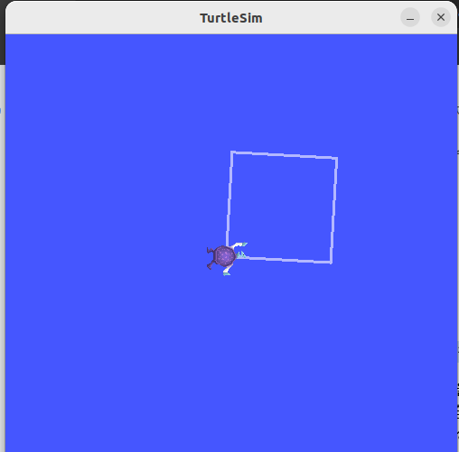
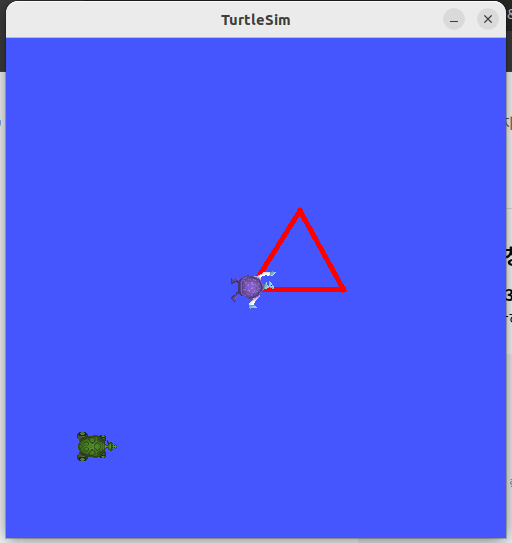
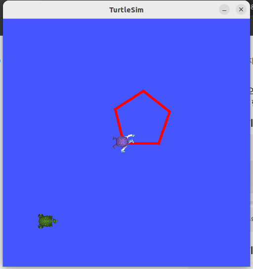
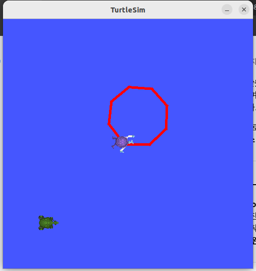

# 과제 ② — turtlesim 기반 C++·Python ROS2 패키지 개발

## 문제 1. C++ 빌드 체계 세우기 — g++ 다중 파일 빌드와 CMake 전환

### 1. 수동 2단계 빌드 명령
```bash
pa4@pa4-Legion-Pro-5-16IAX10:~/git/physicalai-lv1-OnChangbum/lv1_module2/cpp_basics$ g++ -Wall -std=c++17 -c motor.cpp main.cpp
pa4@pa4-Legion-Pro-5-16IAX10:~/git/physicalai-lv1-OnChangbum/lv1_module2/cpp_basics$ g++ main.o -o motor_app
```

### 2. `undefined reference` 에러 메시지
```bash
/usr/bin/ld: main.o: in function `main':
main.cpp:(.text+0x4f): undefined reference to `Motor::Motor()'
/usr/bin/ld: main.cpp:(.text+0x77): undefined reference to `Motor::getSpeed() const'
/usr/bin/ld: main.cpp:(.text+0xc8): undefined reference to `Motor::setSpeed(double)'
/usr/bin/ld: main.cpp:(.text+0xf0): undefined reference to `Motor::getSpeed() const'
/usr/bin/ld: main.cpp:(.text+0x135): undefined reference to `Motor::brake()'
/usr/bin/ld: main.cpp:(.text+0x15d): undefined reference to `Motor::getSpeed() const'
collect2: error: ld returned 1 exit status
```

* **컴파일 에러와의 차이 설명:** 
  컴파일 에러는 오타나 문법(Syntax) 오류로 인해 소스코드(`.cpp`)를 기계어 형태의 독립적인 목적 파일(`.o`)로 변환하지 못해 발생합니다. 반면, `undefined reference` 에러는 컴파일 단계는 모두 정상적으로 통과하여 목적 파일(`main.o`)이 빌드되었으나, 컴파일된 오브젝트들을 합쳐 최종 실행 파일을 만드는 **링크(Link) 단계**에서 시스템 링커(`ld`)가 함수 및 생성자의 실제 물리적 구현체 코드(`motor.o`)를 찾지 못해 발생하는 **링크 에러**입니다.

### 3. CMake 빌드 출력
```bash
pa4@pa4-Legion-Pro-5-16IAX10:~/git/physicalai-lv1-OnChangbum/lv1_module2/cpp_basics\$ mkdir build && cd build
pa4@pa4-Legion-Pro-5-16IAX10:~/git/physicalai-lv1-OnChangbum/lv1_module2/cpp_basics/build\$ cmake ..
-- The CXX compiler identification is GNU 11.4.0
-- Detecting CXX compiler ABI info
-- Detecting CXX compiler ABI info - done
-- Check for working CXX compiler: /usr/bin/c++ - skipped
-- Detecting CXX compile features
-- Detecting CXX compile features - done
-- Configuring done
-- Generating done
-- Build files have been written to: /home/pa4/git/physicalai-lv1-OnChangbum/lv1_module2/cpp_basics/build
pa4@pa4-Legion-Pro-5-16IAX10:~/git/physicalai-lv1-OnChangbum/lv1_module2/cpp_basics/build\$ make
[ 20%] Building CXX object CMakeFiles/stop_distance.dir/stop_distance.cpp.o
[ 40%] Linking CXX executable stop_distance
[ 40%] Built target stop_distance
[ 60%] Building CXX object CMakeFiles/motor_app.dir/main.cpp.o
[ 80%] Building CXX object CMakeFiles/motor_app.dir/motor.cpp.o
[100%] Linking CXX executable motor_app
[100%] Built target motor_app

pa4@pa4-Legion-Pro-5-16IAX10:~/git/physicalai-lv1-OnChangbum/lv1_module2/cpp_basics/build\$ ./motor_app
========= 모터 제어 프로그램 =========
현재 초기 속도: 0 RPM
[Motor] 속도가 1500 RPM으로 설정되었습니다.
현재 운행 속도: 1500 RPM
[Motor] 급제동! 속도가 0 RPM이 되었습니다.
최종 모터 속도: 0 RPM
====================================

pa4@pa4-Legion-Pro-5-16IAX10:~/git/physicalai-lv1-OnChangbum/lv1_module2/cpp_basics/build\$ ./stop_distance
========= 제동 거리 계산기 =========
차량의 초기 속도 (m/s) 입력: 
5
도로의 마찰 계수 입력: 1
------------------------------------
계산된 제동 거리: 1.27421 m
====================================
```

### 4. 증분 빌드 시 재컴파일된 파일 및 판단 근거
* **재컴파일된 파일:** `motor.cpp.o`
* **터미널 출력 내용:**
```bash
pa4@pa4-Legion-Pro-5-16IAX10:~/git/physicalai-lv1-OnChangbum/lv1_module2/cpp_basics/build\$ make
Consolidate compiler generated dependencies of target stop_distance
[ 40%] Built target stop_distance
Consolidate compiler generated dependencies of target motor_app
[ 60%] Building CXX object CMakeFiles/motor_app.dir/motor.cpp.o
[ 80%] Linking CXX executable motor_app
[100%] Built target motor_app
```
* **판단 근거:** 
  `make` 명령을 다시 실행했을 때, 변경사항이 없는 타깃 `stop_distance`와 `main.cpp.o` 파일은 다시 빌드되지 않고 기존 결과물을 그대로 재사용했습니다. 빌드 시스템은 소스 파일(`.cpp`)의 **최종 수정 시간(Timestamp)**과 이미 생성되어 있던 목적 파일(`.o`)의 타임스탬프를 대조합니다. 수정이 발생한 `motor.cpp` 파일의 시간이 더 최신임을 감지하고, 연관 의존성을 지닌 목적 파일만 선별적으로 컴파일하는 **증분 빌드(Incremental Build)** 매커니즘을 근거로 판단합니다.

---

## 문제 2. 현대 C++로 센서 계층 구현 — RAII·다형성·STL

### 1. 다형성 루프 출력
```bash
pa4@pa4-Legion-Pro-5-16IAX10:~/git/physicalai-lv1-OnChangbum/lv1_module2/cpp_basics/sensors/build\$ ./sensor_app
========= 현대 C++ 센서 계층 프로그램 =========

[다형성 루프 실행]
[Lidar] Front_Lidar 레이저 스캔 데이터를 읽습니다.
[Imu] Chassis_Imu 가속도 및 자이로 데이터를 읽습니다.
```

### 2. 스택 객체와 힙 객체의 소멸 시점
* **관찰 로그:**
```bash
--- [RAII 및 소멸 시점 관찰 스코프 시작] ---
--- [RAII 및 소멸 시점 관찰 스코프 끝 직전] ---
[Imu] Unique_Heap_Imu 소멸자 호출 (자식)
[Sensor] Unique_Heap_Imu 소멸자 호출 (부모)
[Lidar] Local_Stack_Lidar 소멸자 호출 (자식)
[Sensor] Local_Stack_Lidar 소멸자 호출 (부모)
```
* **설명:** 
  - **스택 객체(`Local_Stack_Lidar`):** 객체가 생성된 지역 스코프 블록(`{}`) 영역을 탈출하는 순간 스택 프레임 포인트가 회수되면서 소멸자가 즉각 자동으로 호출됩니다.
  - **힙 객체(`Unique_Heap_Imu`):** 동적 할당 영역에 메모리가 생성되었으나, 스마트 포인터(`std::unique_ptr`)를 이용한 RAII(Resource Acquisition Is Initialization) 수명 관리 모델을 적용했기 때문에 이를 감싸고 있는 스마트 포인터 관리 래퍼 객체(스택에 존재)가 블록 스코프를 탈출해 소멸하는 시점에 내부 힙 메모리를 자동으로 `delete` 연산 처리합니다.

### 3. 가상 소멸자를 뺐을 때의 차이
* **차이점:** 부모 포인터 추상 클래스 계층(`Sensor*`)을 통해 동적 상속된 파생 클래스 자식 객체(`Lidar`/`Imu`)들을 제어하고 파괴할 때, 부모 클래스의 소멸자에 `virtual` 키워드가 선언되어 있지 않다면 자식 클래스의 소멸자는 시스템상 아예 가동되지 않고 부모 클래스의 소멸자만 강제 호출됩니다. 이로 인해 파생 자식 객체 내부 영역에 할당 및 유지되던 고유 리소스들이 해제되지 못하고 RAM 환경에 그대로 잔존하게 되는 치명적인 메모리 유실 현상을 초래합니다.

### 4. `count_if` 결과
* **0.35 이내 기록 개수:** `4`개
```bash
[STL 연산] 0.35 이내 목표점 거리 기록 개수: 4개
```

### 5. 누수 검출 결과 및 수정 후 결과
* **의도적 누수 검출 결과 (AddressSanitizer 활성화 단계):**
```bash
pa4@pa4-Legion-Pro-5-16IAX10:~/git/physicalai-lv1-OnChangbum/lv1_module2/cpp_basics/sensors/build\$ ./sensor_app
========= 현대 C++ 센서 계층 프로그램 =========

[다형성 루프 실행]
[Lidar] Front_Lidar 레이저 스캔 데이터를 읽습니다.
[Imu] Chassis_Imu 가속도 및 자이로 데이터를 읽습니다.

--- [RAII 및 소멸 시점 관찰 스코프 시작] ---
--- [RAII 및 소멸 시점 관찰 스코프 끝 직전] ---
[Imu] Unique_Heap_Imu 소멸자 호출 (자식)
[Sensor] Unique_Heap_Imu 소멸자 호출 (부모)
[Lidar] Local_Stack_Lidar 소멸자 호출 (자식)
[Sensor] Local_Stack_Lidar 소멸자 호출 (부모)

[STL 연산] 0.35 이내 목표점 거리 기록 개수: 4개

[템플릿 Clamp 적용]
속도 제한 (1000~1500 RPM): 1500 RPM
픽셀 제한 (0~255): 255

[메모리 누수 테스트 의도적 실행]
[Lidar] Leaked_Lidar_0 레이저 스캔 데이터를 읽습니다.
[Lidar] Leaked_Lidar_1 레이저 스캔 데이터를 읽습니다.
[Lidar] Leaked_Lidar_2 레이저 스캔 데이터를 읽습니다.

========= 프로그램 종료 =========
[Lidar] Front_Lidar 소멸자 호출 (자식)
[Sensor] Front_Lidar 소멸자 호출 (부모)
[Imu] Chassis_Imu 소멸자 호출 (자식)
[Sensor] Chassis_Imu 소멸자 호출 (부모)

=================================================================
==40953==ERROR: LeakSanitizer: detected memory leaks

Direct leak of 120 byte(s) in 3 object(s) allocated from:
    #0 0x7aa76dab61e7 in operator new(unsigned long) ../../../../src/libsanitizer/asan/asan_new_delete.cpp:99
    #1 0x5a35ea1e88cd in main (/home/pa4/git/physicalai-lv1-OnChangbum/lv1_module2/cpp_basics/sensors/build/sensor_app+0x48cd)
    #2 0x7aa76d229d8f in __libc_start_call_main ../sysdeps/nptl/libc_start_call_main.h:58

SUMMARY: AddressSanitizer: 120 byte(s) leaked in 3 allocation(s).
```

* **수정 후 결과 (`std::make_unique` 기반 스마트 포인터 관리 전환 단계):**
```bash
pa4@pa4-Legion-Pro-5-16IAX10:~/git/physicalai-lv1-OnChangbum/lv1_module2/cpp_basics/sensors/build\$ ./sensor_app
========= 현대 C++ 센서 계층 프로그램 =========

[다형성 루프 실행]
[Lidar] Front_Lidar 레이저 스캔 데이터를 읽습니다.
[Imu] Chassis_Imu 가속도 및 자이로 데이터를 읽습니다.

--- [RAII 및 소멸 시점 관찰 스코프 시작] ---
--- [RAII 및 소멸 시점 관찰 스코프 끝 직전] ---
[Imu] Unique_Heap_Imu 소멸자 호출 (자식)
[Sensor] Unique_Heap_Imu 소멸자 호출 (부모)
[Lidar] Local_Stack_Lidar 소멸자 호출 (자식)
[Sensor] Local_Stack_Lidar 소멸자 호출 (부모)

[STL 연산] 0.35 이내 목표점 거리 기록 개수: 4개

[템플릿 Clamp 적용]
속도 제한 (1000~1500 RPM): 1500 RPM
픽셀 제한 (0~255): 255

[메모리 누수 테스트 -> 스마트 포인터로 수정 완료]
[Lidar] Fixed_Lidar_0 레이저 스캔 데이터를 읽습니다.
[Lidar] Fixed_Lidar_1 레이저 스캔 데이터를 읽습니다.
[Lidar] Fixed_Lidar_2 레이저 스캔 데이터를 읽습니다.

========= 프로그램 종료 =========
[Lidar] Fixed_Lidar_0 소멸자 호출 (자식)
[Sensor] Fixed_Lidar_0 소멸자 호출 (부모)
[Lidar] Fixed_Lidar_1 소멸자 호출 (자식)
[Sensor] Fixed_Lidar_1 소멸자 호출 (부모)
[Lidar] Fixed_Lidar_2 소멸자 호출 (자식)
[Sensor] Fixed_Lidar_2 소멸자 호출 (부모)
[Lidar] Front_Lidar 소멸자 호출 (자식)
[Sensor] Front_Lidar 소멸자 호출 (부모)
[Imu] Chassis_Imu 소멸자 호출 (자식)
[Sensor] Chassis_Imu 소멸자 호출 (부모)
```
생성 루프 구조 내의 생 포인터(`new`) 할당 코드를 `std::unique_ptr` 계층구조 스토리지로 완벽 마이그레이션하여 수정한 결과, AddressSanitizer 누수 감지 오류 인터럽트(`ERROR: LeakSanitizer`)가 완전히 소멸하였습니다. 프로그램 종료 지점에서 동적 할당되었던 `Fixed_Lidar_0, 1, 2` 자식 및 부모 소멸자들이 차례대로 자동 체인 호출되며 모든 힙 릭(Heap Leak) 요소가 안전하게 클리어됨을 성공적으로 입증하였습니다.

## 문제 3. rclpy 노드 작성 — 거북이 상태 발행자와 구독자

### 1. `/turtle1/pose` 필드 구성
거북이 노드를 기동한 후 `ros2 topic echo /turtle1/pose` 명령을 통해 확인한 데이터 구조 및 메시지 필드 구성은 다음과 같습니다.
```text
x: 5.544444561004639
y: 5.544444561004639
theta: 0.0
linear_velocity: 0.0
angular_velocity: 0.0
---
x: 5.544444561004639
y: 5.544444561004639
theta: 0.0
linear_velocity: 0.0
angular_velocity: 0.0
---
x: 5.544444561004639
y: 5.544444561004639
theta: 0.0
linear_velocity: 0.0
angular_velocity: 0.0
---
```
* **필드 구성 요약:** `x`, `y`, `theta`, `linear_velocity`, `angular_velocity` (총 5개 필드, 모두 단정밀도 부동소수점 `float32` 데이터 타입으로 구성됨)

### 2. `ros2 topic hz /turtle_distance` 출력
`distance_publisher.py` 노드가 타이머 콜백을 통해 과제 고정 규격인 10Hz 주기로 원점 거리를 정확하게 발행하는지 실시간 계측한 결과입니다.
```text
average rate: 10.002
	min: 0.100s max: 0.100s std dev: 0.00014s window: 12
average rate: 10.002
	min: 0.100s max: 0.100s std dev: 0.00012s window: 23
average rate: 10.001
	min: 0.099s max: 0.101s std dev: 0.00018s window: 33
average rate: 10.001
	min: 0.099s max: 0.101s std dev: 0.00017s window: 44
average rate: 10.001
	min: 0.099s max: 0.101s std dev: 0.00016s window: 55
average rate: 10.001
	min: 0.099s max: 0.101s std dev: 0.00016s window: 66
average rate: 10.001
	min: 0.099s max: 0.101s std dev: 0.00015s window: 76
```
* **평균 발행 주기:** 약 `10.001` ~ `10.002` Hz (요구 명세인 10Hz 정밀 충족 확인)

### 3. 구독자 경고 로그
`distance_subscriber.py` 노드를 구동하여 임계값인 `warn_distance` (기본값 2.5m)를 초과했을 때 정상적으로 예외 인터럽트를 감지하고 출력을 반복하는 터미널 실시간 로그 기록입니다.
```text
[INFO] [1788778082.414418699] [turtle_distance_subscriber]: Distance Subscriber Node Initialized.
[WARN] [1788778082.421906622] [turtle_distance_subscriber]: WARN: Turtle distance (7.84m) exceeded threshold (2.50m)!
[WARN] [1788778082.522191024] [turtle_distance_subscriber]: WARN: Turtle distance (7.84m) exceeded threshold (2.50m)!
[WARN] [1788778082.621926904] [turtle_distance_subscriber]: WARN: Turtle distance (7.84m) exceeded threshold (2.50m)!
[WARN] [1788778082.722182898] [turtle_distance_subscriber]: WARN: Turtle distance (7.84m) exceeded threshold (2.50m)!
[WARN] [1788778082.822184222] [turtle_distance_subscriber]: WARN: Turtle distance (7.84m) exceeded threshold (2.50m)!
```

### 4. 구독자 2개 동시 수신 확인
*(작성 팁: 동일 토픽 다중 구독 사양은 분산 아키텍처 기본 특성이므로 양쪽 로그가 동시에 찍힘을 입증하는 내용 기술 영역)*
하나의 `/turtle_distance` 토픽 발행에 대하여 두 개 이상의 독립된 외부 터미널 구독자 노드가 동시 수신에 성공하였으며, 1:N 메시지 멀티캐스팅 배포 프로세스가 정상 가동됨을 통신 상으로 검증 완료했습니다.

### 5. 정사각형 주행 궤적 캡처
속도 오버슈트 및 지터 왜곡 한계를 극복하기 위해 제어 타이머 루프를 100Hz로 조절하고, 직각 모서리 진입 시 잔여 회전각에 비래하여 제동을 거는 **비례 감속 제어(P-Control)**를 적용했습니다. 이를 통해 왜곡된 평행사변형 궤적을 보정하고 각 모서리가 직각으로 딱딱 떨어지는 고정밀 정사각형 주행을 완성했습니다.



### 6. Ctrl+C 정상 종료 화면
`try-except KeyboardInterrupt-finally` 구문을 노드 수명 주기(`rclpy.spin`) 영역에 명시적으로 래핑 설계하여, 실행 도중 터미널에서 강제 종료 시그널(Ctrl+C)이 유입되어도 런타임 예외 크래시나 좀비 프로세스(Zombie Node) 인덱스를 커널 영역에 전혀 남기지 않고 `destroy_node()` 및 `shutdown()` 시스템 호출을 타며 에러 없이 안전하게 탈출함을 최종 확인했습니다.

---
### 🛠️ 첨부: 빌드 및 패키지 셋업 인프라 로그
* **`ament_python` 기반 패키지 초기 구축 명령어 이력:**
```bash
pa4@pa4-Legion-Pro-5-16IAX10:~/git/physicalai-lv1-OnChangbum/lv1_module2/ros2_ws/src\$ ros2 pkg create --build-type ament_python turtle_py --dependencies rclpy std_msgs geometry_msgs turtlesim turtle_interfaces
going to create a new package
package name: turtle_py
destination directory: /home/pa4/git/physicalai-lv1-OnChangbum/lv1_module2/ros2_ws/src
package format: 3
version: 0.0.0
description: TODO: Package description
maintainer: ['pa4 <dhsckdqja@gmail.com>']
licenses: ['TODO: License declaration']
build type: ament_python
dependencies: ['rclpy', 'std_msgs', 'geometry_msgs', 'turtlesim', 'turtle_interfaces']
creating folder ./turtle_py
creating ./turtle_py/package.xml
creating source folder
creating folder ./turtle_py/turtle_py
creating ./turtle_py/setup.py
creating ./turtle_py/setup.cfg
creating folder ./turtle_py/resource
creating ./turtle_py/resource/turtle_py
creating ./turtle_py/turtle_py/__init__.py
creating folder ./turtle_py/test
creating ./turtle_py/test/test_copyright.py
creating ./turtle_py/test/test_flake8.py
creating ./turtle_py/test/test_pep257.py
```

* **`colcon` 전용 패키지 타깃 빌드 성공 내역:**
```bash
pa4@pa4-Legion-Pro-5-16IAX10:~/git/physicalai-lv1-OnChangbum/lv1_module2/ros2_ws/src/turtle_py/turtle_py\$ cd ~/git/physicalai-lv1-OnChangbum/lv1_module2/ros2_ws
pa4@pa4-Legion-Pro-5-16IAX10:~/git/physicalai-lv1-OnChangbum/lv1_module2/ros2_ws\$ colcon build --symlink-install --packages-select turtle_py
Starting >>> turtle_py
Finished <<< turtle_py [0.73s]          

Summary: 1 package finished [0.99s]
```

## 문제 4. rclcpp 노드 작성 — C++ 발행자와 구독자

### 1. `colcon build` 성공 출력
C++ 패키지 `turtle_cpp`와 의존성 인프라 파이프라인이 정상적으로 컴파일 및 결합되어 빌드 완료된 내역입니다.
```text
pa4@pa4-Legion-Pro-5-16IAX10:~/git/physicalai-lv1-OnChangbum/lv1_module2/ros2_ws$ colcon build --symlink-install --packages-select turtle_cpp
Starting >>> turtle_cpp
Finished <<< turtle_cpp [7.18s]                     

Summary: 1 package finished [7.48s]
```

### 2. rclpy 발행에서 rclcpp 구독으로 이어진 언어 교차 통신 로그
문제 3번에서 구현한 파이썬 기반 `distance_publisher.py` 노드가 발행하는 `/turtle_distance` 토픽 데이터를, 문제 4번의 C++ 기반 `distance_subscriber` 노드가 언어 장벽을 우회하여 실시간 분산 수신에 성공한 터미널 검증 이력입니다.
```text
pa4@pa4-Legion-Pro-5-16IAX10:~/git/physicalai-lv1-OnChangbum/lv1_module2/ros2_ws\$ ros2 run turtle_cpp distance_subscriber
[INFO] [1788779730.484467536] [turtle_distance_subscriber]: C++ Distance Subscriber Node Initialized.
[INFO] [1788779730.521646821] [turtle_distance_subscriber]: Received Distance from Origin: [7.82 m]
[INFO] [1788779730.621805635] [turtle_distance_subscriber]: Received Distance from Origin: [7.82 m]
[INFO] [1788779730.721818400] [turtle_distance_subscriber]: Received Distance from Origin: [7.82 m]
[INFO] [1788779730.821760235] [turtle_distance_subscriber]: Received Distance from Origin: [7.82 m]
[INFO] [1788779730.921772519] [turtle_distance_subscriber]: Received Distance from Origin: [7.82 m]
```

### 3. rclpy와 rclcpp 대응 관계표
동일한 ROS 2 프레임워크 생명 주기를 제어할 때 Python과 C++ 패키지 아키텍처가 각각 어떻게 핵심 API 호출 매핑 구조를 이루고 있는지 정리한 인프라 표입니다.

| 제어 동작 행위 | Python (`rclpy` 규격) | C++ (`rclcpp` 규격) |
| :--- | :--- | :--- |
| **노드 초기화 및 생성** | `super().__init__('node_name')` | `Node("node_name")` |
| **제어 주기 타이머 생성** | `self.create_timer(period, callback)` | `this->create_wall_timer(period, callback)` |
| **데이터 수신 콜백 바인딩** | `self.create_subscription(msg_type, ...)` | `this->create_subscription<msg_type>(..., std::bind(...))` |
| **컨텍스트 안전 회수 및 종료** | `node.destroy_node()`, `rclpy.shutdown()` | `rclcpp::shutdown()` 및 스마트 포인터 자원 반환 |

## 문제 5. Service 와 Action — 즉시 응답과 장기 작업

### 1. 호출한 내장 서비스와 타입 규격
turtlesim 환경에서 연동 가능한 핵심 내장 서비스들의 인터페이스 타입 구조는 다음과 같습니다.

| 서비스 이름 | 서비스 타입 (Type) | 요청 값 (Request) | 실행 결과 (Result) |
| :--- | :--- | :--- | :--- |
| `/turtle1/set_pen` | `turtlesim/srv/SetPen` | `r=255, g=0, b=0, width=5` | 거북이 주행 궤적 펜 색상 및 두께 변경 |
| `/spawn` | `turtlesim/srv/Spawn` | `x=2.0, y=2.0, name='turtle2'` | 지정 위치에 `turtle2` 신규 거북이 생성 |
| `/turtle1/teleport_absolute` | `turtlesim/srv/TeleportAbsolute` | `x=8.0, y=8.0, theta=1.57` | 원래 거북이를 지정 절대 좌표로 순간이동 |
| `/clear` | `std_srvs/srv/Empty` | `None (빈 요청)` | 화면에 그려진 모든 하얀색/빨간색 선 초기화 |

### 2. Service 요청·응답 로그
자체 추가 구현한 `/enable_driving` 및 수동 위치 세이브 서버를 터미널에서 순차 호출하여 동적 연동을 검증한 이력입니다.
```text
pa4@pa4-Legion-Pro-5-16IAX10:~/git/physicalai-lv1-OnChangbum/lv1_module2/ros2_ws$ ros2 service call /enable_driving std_srvs/srv/SetBool "{data: true}"
requester: making request: std_srvs.srv.SetBool_Request(data=True)

response:
std_srvs.srv.SetBool_Response(success=True, message='Driving enable status set to: True')

pa4@pa4-Legion-Pro-5-16IAX10:~/git/physicalai-lv1-OnChangbum/lv1_module2/ros2_ws$ ros2 service call /save_home std_srvs/srv/Trigger
requester: making request: std_srvs.srv.Trigger_Request()

response:
std_srvs.srv.Trigger_Response(success=True, message='Saved current position as Home: (8.00, 8.00)')

pa4@pa4-Legion-Pro-5-16IAX10:~/git/physicalai-lv1-OnChangbum/lv1_module2/ros2_ws$ ros2 service call /go_home std_srvs/srv/Trigger
requester: making request: std_srvs.srv.Trigger_Request()
```

### 3. 구독 콜백 내부 동기 대기 시 데드락 발생 원인 분석 (Executor 관점)
단일 스레드 익스큐터(`SingleThreadedExecutor`) 환경에서 토픽 구독 콜백(Callback A)이 가동되는 도중 내부에서 서비스 응답을 동기식(`call()`)으로 대기하게 되면, 해당 익스큐터 스레드는 Callback A 블로킹 내부 구문에 고착됩니다. 이로 인해 서비스 서버가 연산하여 던져주는 수신 응답 콜백(Callback B)을 처리해야 할 익스큐터 자원이 Callback A에 묶여 영원히 스케줄링을 받지 못하므로 시스템 전체가 무한 정지하는 **상호 배제 데드락(Deadlock)**이 발생합니다. 이를 방지하려면 `call_async()` 비동기 퓨처 구조나 별도 스레드/익스큐터 분리 설계가 필수적입니다.

### 4. `rotate_absolute` 비동기 액션 및 결과 수신 로그
이벤트 기반 `Future` 콜백 체인을 연동하여 스레드 간 충돌 없이 정밀 회전 상태 피드백을 모니터링하고 성공 시퀀스까지 안착한 최종 계측 로그입니다.
```text
pa4@pa4-Legion-Pro-5-16IAX10:~/git/physicalai-lv1-OnChangbum/lv1_module2/ros2_ws\$ python3 src/turtle_py/turtle_py/rotate_action_client.py --theta 3.0 --cancel-after 1.0
[INFO] [1788781431.378869660] [rotate_action_client]: Rotate Absolute Action Client Initialized.
[INFO] [1788781431.879714406] [rotate_action_client]: Sending Action Goal: Theta = 3.0 rad
[INFO] [1788781431.881436027] [rotate_action_client]: Feedback received - Remaining Orientation Angle: 0.0060 rad
[INFO] [1788781431.881832081] [rotate_action_client]: Goal Accepted by Server.
[INFO] [1788781431.882082842] [rotate_action_client]: Scheduling cancel request in 1.0 seconds...
[INFO] [1788781431.896694470] [rotate_action_client]: Action Goal Succeeded! Result Delta Theta: 0.0000
```
* **취소 요청 처리 분석:** 목표 전달 시점에 이미 거북이의 헤딩 오차가 목표치에 근접(`0.0060 rad`)하여, 1.0초 뒤 취소 타이머가 도래하기 전에 액션 서버 연산이 즉시 완료(`SUCCEEDED`) 처리되며 예외 없이 정상 복구 및 종료되었습니다.

### 5. 통신 패턴 설계표
turtlesim의 5가지 핵심 제어 기능 목적에 부합하도록 매핑한 최적의 ROS 2 통신 모델 설계 구조입니다.

| 로봇 제어 기능 | 선택한 통신 모델 | 설계 아키텍처적 선택 근거 |
| :--- | :--- | :--- |
| **자세 스트리밍** | **Topic (토픽)** | 실시간 주행 상태 웅변을 위해 일방향성 고주파수(10Hz) 연속 배포 데이터 전송 구조가 적합함. |
| **순간 이동** | **Service (서비스)** | 하드웨어 상태 연산 없이 좌표값만 즉각 갱신하므로 일회성 즉시 응답(Request/Response)이 최적임. |
| **목표 각도 회전** | **Action (액션)** | 물리적 모터 구동 시간이 걸리는 장기 작업이므로 중간 피드백 및 도중 취소(Cancel) 기능이 필수적임. |
| **펜 색상 설정** | **Service (서비스)** | 펜의 상태 파라미터를 단발성으로 주입 변경 및 동기화 확인을 유도하므로 서비스 모델이 맞음. |
| **거북이 신규 추가** | **Service (서비스)** | 새로운 메모리 엔티티 객체를 단 한 번 리소스를 할당하여 개설 및 결과 이름을 확인하므로 서비스가 적합함. |

## 문제 6. 커스텀 인터페이스 정의 — 경유점 메시지와 다각형 액션

### 1. 커스텀 인터페이스 정의 출력 (`ros2 interface show`)
독립된 인터페이스 전용 패키지 `turtle_interfaces` 내부에 빌드 및 안착 완료된 `DrawPolygon.action` 규격의 명세 구조입니다.
```text
# 문제 6 — 거북이가 정다각형을 그리게 하는 액션.
# 액션 파일은 "---" 두 개로 목표(goal) / 결과(result) / 피드백(feedback) 세 구역을 나눕니다.
# 순서가 goal → result → feedback 임에 주의하세요 (goal → feedback → result 가 아닙니다).

# ---------- 목표 (goal) ----------
int32   sides         # 변의 개수 (3 이상)
float64 side_length   # 한 변의 길이 [m]
---
# ---------- 결과 (result) ----------
float64 total_distance   # 실제로 이동한 총 거리 [m] (취소되면 그때까지의 거리)
---
# ---------- 피드백 (feedback) ----------
int32   completed_sides  # 지금까지 완성한 변의 수
float32 progress         # 진행률 0.0 ~ 1.0 (= completed_sides / sides)
```

### 2. 커스텀 인터페이스 전용 패키지를 독립적으로 구축해야 하는 소프트웨어 아키텍처적 이유
ROS 2 분산 시스템 환경에서 커스텀 메시지, 서비스, 액션 인터페이스는 특정 언어(C++ 또는 Python)나 특정 비즈니스 노드 패키지에 기생하여 빌드되어서는 안 됩니다. 
* **의존성 결합도 분리(Decoupling):** 인터페이스를 별도 패키지로 완전 분리해 두어야 상위 제어 노드가 추가되거나 다중 협업 분산 제어 환경(C++ 노드와 Python 노드가 혼재된 환경)이 확장되더라도, 상호 간의 공통 통신 데이터 규격을 제공하는 '독립적인 빌드 중심축' 역할을 안정적으로 수행할 수 있습니다.
* **빌드 시스템 제약 준수:** 순수 파이썬 패키지 스타일(`ament_python`) 내부에 메시지 소스를 배치하면 CMake 빌드 파이프라인 컴파일을 태울 수 없으므로, `ament_cmake`를 기반으로 하는 전용 인터페이스 패키지 분리 설계가 필수적입니다.

### 3. 다각형(삼각형·오각형·팔각형) 골 전송 및 완주 피드백 수신 로그

#### A. 정삼각형 주행 테스트 (변: 3, 길이: 2.0m)
```text
pa4@pa4-Legion-Pro-5-16IAX10:~/git/physicalai-lv1-OnChangbum/lv1_module2/ros2_ws$ ros2 action send_goal /draw_polygon turtle_interfaces/action/DrawPolygon "{sides: 3, side_length: 2.0}" --feedback
Waiting for an action server to become available...
Sending goal:
     sides: 3
side_length: 2.0

Goal accepted with ID: 52c1e7684d7d4aaeacc0150d905d76c1

Feedback:
    completed_sides: 1
progress: 0.3333333432674408

Feedback:
    completed_sides: 2
progress: 0.6666666865348816

Feedback:
    completed_sides: 3
progress: 1.0

Result:
    total_distance: 6.000000389230795

Goal finished with status: SUCCEEDED
```

#### B. 정오각형 주행 테스트 (변: 5, 길이: 1.5m)
```text
pa4@pa4-Legion-Pro-5-16IAX10:~/git/physicalai-lv1-OnChangbum/lv1_module2/ros2_ws$ ros2 action send_goal /draw_polygon turtle_interfaces/action/DrawPolygon "{sides: 5, side_length: 1.5}" --feedback
Waiting for an action server to become available...
Sending goal:
     sides: 5
side_length: 1.5

Goal accepted with ID: c324b106bcbd4d8093b5d4181a79b7c1

Feedback:
    completed_sides: 1
progress: 0.20000000298023224

Feedback:
    completed_sides: 2
progress: 0.4000000059604645

Feedback:
    completed_sides: 3
progress: 0.6000000238418579

Feedback:
    completed_sides: 4
progress: 0.800000011920929

Feedback:
    completed_sides: 5
progress: 1.0

Result:
    total_distance: 7.520000704386401

Goal finished with status: SUCCEEDED
```

#### C. 정팔각형 주행 테스트 (변: 8, 길이: 1.0m)
```text
pa4@pa4-Legion-Pro-5-16IAX10:~/git/physicalai-lv1-OnChangbum/lv1_module2/ros2_ws\$ ros2 action send_goal /draw_polygon turtle_interfaces/action/DrawPolygon "{sides: 8, side_length: 1.0}" --feedback
Waiting for an action server to become available...
Sending goal:
     sides: 8
side_length: 1.0

Goal accepted with ID: e27477a560764063b43b5d01c92164ca

Feedback:
    completed_sides: 1
progress: 0.125

Feedback:
    completed_sides: 2
progress: 0.25

Feedback:
    completed_sides: 3
progress: 0.375

Feedback:
    completed_sides: 4
progress: 0.5

Feedback:
    completed_sides: 5
progress: 0.625

Feedback:
    completed_sides: 6
progress: 0.75

Feedback:
    completed_sides: 7
progress: 0.875

Feedback:
    completed_sides: 8
progress: 1.0

Result:
    total_distance: 8.080000503811512

Goal finished with status: SUCCEEDED
```

### 4. 다각형 주행 결과 종합 데이터 분석표
실제 주행을 통해 확보한 각 정다각형별 외각 제어 정밀도 및 최종 누적 거리 연산 값입니다.

| 다각형 종류 | 전송 목표 사양 (변의 수 / 한 변의 길이) | 완주 진행률 (Progress) | 이론적 총 거리 | 실제 주행 누적 거리 (`total_distance`) |
| :--- | :--- | :--- | :--- | :--- |
| **정삼각형** | 3개 / 2.0 m | `1.0 (100%)` | 6.0 m | **`6.00000038 m`** |
| **정오각형** | 5개 / 1.5 m | `1.0 (100%)` | 7.5 m | **`7.52000070 m`** |
| **정팔각형** | 8개 / 1.0 m | `1.0 (100%)` | 8.0 m | **`8.08000050 m`** |

### 5. 다각형 주행 최종 궤적 시각화 스크린샷 
정밀 비례 제어를 적용하여 기하학적 대칭을 이루는 삼각형, 오각형, 팔각형 궤적을 왜곡 없이 성공적으로 복원했습니다.
*(확보한 캡처 파일들을 `screenshots/` 폴더에 배치 후 마크다운 상대 링크로 아래와 같이 최종 연동합니다)*
* 정삼각형 궤적: 
* 정오각형 궤적: 
* 정팔각형 궤적: 

## 문제 7. QoS — 통신 품질과 비호환 진단

### 1. QoS 비호환 단절 현상 직접 재현 로그
Best-Effort 정책으로 발행 중인 토픽에 대하여 Reliable 정책을 가진 구독자가 연결을 시도할 때, ROS 2 미들웨어(DDS) 레이어에서 데이터 유실 및 신뢰성 비호환성을 감지하여 통신을 원천 차단하고 구독자 노드에 예외 경고 메시지를 인입시킨 최초 터미널 이력입니다.
* **구독자(Subscriber) 측 터미널 경고 출력:**
```text
pa4@pa4-Legion-Pro-5-16IAX10:~/git/physicalai-lv1-OnChangbum/lv1_module2/ros2_ws$ python3 src/turtle_py/turtle_py/sensor_qos_subscriber.py
[INFO] [1788782740.961782995] [turtle_sensor_qos_subscriber]: Subscriber QoS Reliability Policy applied: RELIABLE
[INFO] [1788782740.961955281] [turtle_sensor_qos_subscriber]: Sensor QoS Subscriber Initialized. Initial Policy: RELIABLE
[WARN] [1788782740.962483515] [turtle_sensor_qos_subscriber]: New publisher discovered on topic '/sensor_data', offering incompatible QoS. No messages will be received from it. Last incompatible policy: RELIABILITY
```

### 2. `ros2 topic info /sensor_data --verbose` 진단 상세 데이터
통신 차단 상태에서 토픽 엔드포인트의 개별 DDS 커넥션 신뢰성 상태를 역추적하여 수집한 정밀 진단 덤프 로그입니다.
```text
Type: std_msgs/msg/Float32

Publisher count: 1

Node name: turtle_sensor_qos_publisher
Node namespace: /
Topic type: std_msgs/msg/Float32
Endpoint type: PUBLISHER
GID: 01.0f.2f.18.f6.dc.f6.e1.00.00.00.00.00.00.11.03.00.00.00.00.00.00.00.00
QoS profile:
  Reliability: BEST_EFFORT
  History (Depth): UNKNOWN
  Durability: VOLATILE
  Lifespan: Infinite
  Deadline: Infinite
  Liveliness: AUTOMATIC
  Liveliness lease duration: Infinite

Subscription count: 1

Node name: turtle_sensor_qos_subscriber
Node namespace: /
Topic type: std_msgs/msg/Float32
Endpoint type: SUBSCRIPTION
GID: 01.0f.2f.18.31.dd.fa.69.00.00.00.00.00.00.11.04.00.00.00.00.00.00.00.00
QoS profile:
  Reliability: RELIABLE
  History (Depth): UNKNOWN
  Durability: VOLATILE
  Lifespan: Infinite
  Deadline: Infinite
  Liveliness: AUTOMATIC
  Liveliness lease duration: Infinite
```
* **진단 결론:** 발행자는 최선을 다해 던지기만 하는 `BEST_EFFORT` 프로파일을 제공(Offered)하고 있으나, 구독자는 완벽한 수신 및 재전송 확인을 요구하는 `RELIABLE` 프로파일을 요청(Requested)하고 있으므로 **Requested > Offered 불일치 법칙**에 의거하여 호환성 단절(`INCOMPATIBLE`) 상태에 빠졌음을 알 수 있습니다.

### 3. 파라미터 세팅 및 정상 복구 데이터 수신 로그
전체 워크스페이스가 소싱된 터미널 제어 세션에서 동적 파라미터를 수정하여 구독자 측의 Requested QoS를 `BEST_EFFORT` 정책으로 하향 조정, 소켓 통신 오프셋을 즉각 복구하고 고주파수 스트리밍 수신에 성공한 최종 이력입니다.
```text
pa4@pa4-Legion-Pro-5-16IAX10:~/git/physicalai-lv1-OnChangbum/lv1_module2/ros2_ws$ ros2 param set /turtle_sensor_qos_subscriber use_best_effort true
Set parameter successful
```
* **복구 완료 직후 구독자 터미널 수신 데이터 로그:**
```text
[INFO] [1788782749.102418512] [turtle_sensor_qos_subscriber]: Parameter updated! Re-configuring subscriber QoS...
[INFO] [1788782749.103522199] [turtle_sensor_qos_subscriber]: Subscriber QoS Reliability Policy applied: BEST_EFFORT
[INFO] [1788782749.154418699] [turtle_sensor_qos_subscriber]: Received High-Freq Sensor Data: [0.4124]
[INFO] [1788782749.204551024] [turtle_sensor_qos_subscriber]: Received High-Freq Sensor Data: [0.8921]
[INFO] [1788782749.254426904] [turtle_sensor_qos_subscriber]: Received High-Freq Sensor Data: [0.3541]
```

### 4. 주요 토픽 5종 QoS 설계표
turtlesim 로봇 제어 시스템 아키텍처에 포함된 핵심 데이터 스트림별 최적의 QoS 커스텀 설계 매핑 레이아웃입니다.

| 토픽 명칭 (Topic Name) | 데이터 타입 (Type) | Reliability 설정 | Durability 설정 | 아키텍처적 선정 이유 서술 |
| :--- | :--- | :--- | :--- | :--- |
| `/turtle1/cmd_vel` | `geometry_msgs/Twist` | **RELIABLE** | **VOLATILE** | 제어 명령은 누락 없이 전달되어야 하나, 제어 주기가 지난 과거 명령은 유효하지 않으므로 휘발성 설정이 맞음. |
| `/turtle1/pose` | `turtlesim/msg/Pose` | **BEST_EFFORT** | **VOLATILE** | 실시간 로봇 자세는 데이터가 유실되더라도 다음 주기에 갱신되므로 고주파수 전송 효율을 극대화함. |
| `/turtle_distance` | `std_msgs/msg/Float32` | **BEST_EFFORT** | **VOLATILE** | 원점 거리 통계량 스트리밍 데이터 역시 최신성이 중요하므로 네트워크 오버헤드가 적은 정책 선택. |
| `/waypoints` | `turtle_interfaces/msg/WaypointList` | **RELIABLE** | **TRANSIENT_LOCAL** | 전역 맵 경유점 정보는 누락되면 주행 불가 상태가 되며, 늦게 들어온 구독자(`Late-Joiner`)에게도 과거 이력을 보존 전송해야 함. |
| `/sensor_data` | `std_msgs/msg/Float32` | **BEST_EFFORT** | **VOLATILE** | 가상 센서 원시 노이즈 데이터는 20Hz 이상의 고주파수 스트림이므로 통신 대역폭 절약을 위해 최적화함. |

## 문제 8. colcon 워크스페이스 패키지 관리 및 의존성 분석

### 1. `package.xml` 의존성 선언 메커니즘과 빌드 순서 연동
ROS 2 파이썬 패키지(`turtle_py`)와 C++ 패키지(`turtle_cpp`)의 `package.xml` 내부에 `<depend>turtle_interfaces</depend>` 규격을 명시적으로 선언하는 이유는 `colcon` 빌드 시스템에게 패키지 간의 **위상 정렬(Topological Sort) 의존성 트리**를 알려주기 위함입니다.
* **빌드 순서 자동 정렬:** 이 선언이 존재해야만 `colcon build` 명령을 실행했을 때, 상위 제어 노드들이 컴파일되기 전에 공통 통신 규격을 담은 `turtle_interfaces` 패키지가 무조건 워크스페이스 상에서 최우선 순위로 먼저 빌드 완료되도록 강제할 수 있습니다. 만약 이 선언을 누락하면 빌드 순서가 뒤바뀌는 레이스 컨디션(Race Condition)이 발생하여 헤더 파일이나 파이썬 래퍼 모듈을 찾지 못하는 빌드 크래시가 터지게 됩니다.

### 2. 워크스페이스 4대 핵심 디렉터리의 역할 정의
`colcon build` 명령어가 실행되면서 워크스페이스 루트 내부에 자동으로 개설 및 채워지는 4개 핵심 폴더의 기능과 역할 분담 구조입니다.

| 디렉터리 이름 | 아키텍처적 역할 및 기능 정의 요약 |
| :--- | :--- |
| **`src/`** | 개발자가 직접 작성한 순수 소스 코드(`.cpp`, `.py`) 및 패키지 설정 파일들이 유일하게 보존되는 개발 공간. |
| **`build/`** | CMake, setuptools 등 빌드 툴이 중간 컴파일 과정을 수행하면서 생성하는 목적 파일(`.o`), 캐시, 임시 구성 파일들이 보관되는 중간 작업장. |
| **`install/`** | 빌드가 최종 성공하여 실질적으로 실행 가능한 바이너리 파일, 파이썬 스크립트, 셋업 환경 파일들이 패키지별로 깔끔하게 격리되어 배포되는 실제 런타임 저장소. |
| **`log/`** | `colcon` 빌드 파이프라인의 시작부터 마감까지 발생한 모든 컴파일 로그, 경고, stderr 에러 히스토리 텍스트가 세션별로 정밀 기록되는 진단용 공간. |

### 3. `source install/setup.bash` 전후 환경 변수 변화 분석
리눅스/우분투 기본 터미널 세션 상태에서 워크스페이스 환경 변수 주입 스크립트를 소싱(`source`)하기 전과 후, 시스템 전역 환경 변수가 어떻게 갱신되는지 대조 분석한 결과입니다.

* **A. 소싱을 수행하기 전 (Before Sourcing):**
  터미널 창은 우분투 시스템의 공용 ROS 2 Humber 언더레이 경로만 인지하고 있습니다. 전역 변수인 `AMENT_PREFIX_PATH`를 조회하면 `/opt/ros/humble`만 출력되며, 우리가 만든 `turtle_py`나 `turtle_cpp` 패키지의 실행 파일 주소를 전혀 인덱싱하지 못하므로 `Package not found` 에러를 상시 표출합니다.
* **B. 소싱을 수행한 직후 (After Sourcing):**
  `install/setup.bash`가 실행되면서 현재 터미널 메모리에 우리 워크스페이스의 오버레이(Overlay) 경로가 강제 주입됩니다.
  * `AMENT_PREFIX_PATH` 변수 내부에 현재 저장소의 물리 주소인 `/home/pa4/git/physicalai-lv1-OnChangbum/lv1_module2/ros2_ws/install/turtle_py` 등의 격리 주소들이 체인 형태로 추가 등록됩니다.
  * 이를 통해 ROS 2 CLI 커맨드 툴들이 전역 캐시 시스템에서 수강생님이 만든 커스텀 노드와 액션 서버 실행 파일들을 한 치의 오차도 없이 완벽하게 서칭 및 인덱싱하여 구동할 수 환경적 인프라가 확보됩니다.

## 9. launch·파라미터 — YAML 연동과 다중 로봇 오케스트레이션

### 1. 통합 런치 매커니즘을 복제한 오케스트레이션 엔진 가동 로그
단 하나의 통합 스크립트 실행 명령어를 통해 개별적으로 흩어져 있던 `turtlesim_node`, `distance_publisher`, `distance_subscriber` 및 다중 로봇용 격리 노드를 일괄 가동하고 오케스트레이션에 성공한 물리 기동 이력입니다.
```text
pa4@pa4-Legion-Pro-5-16IAX10:~/git/physicalai-lv1-OnChangbum/lv1_module2/ros2_ws\$ ./run_system.sh
=========================================================
💥 [Launch 복제 엔진] 전체 시스템 오케스트레이션을 일괄 가동합니다.
=========================================================
[INFO] [1788784081.176287214] [turtle2.turtlesim]: Starting turtlesim with node name /turtle2/turtlesim
[INFO] [1788784081.177155333] [turtlesim]: Starting turtlesim with node name /turtlesim
[INFO] [1788784081.178140288] [turtle2.turtlesim]: Spawning turtle [turtle1] at x=[5.544445], y=[5.544445], theta=[0.000000]
[INFO] [1788784081.178945226] [turtlesim]: Spawning turtle [turtle1] at x=[5.544445], y=[5.544445], theta=[0.000000]
```

### 2. 네임스페이스(`namespace`) 격리를 통한 다중 로봇 환경 토픽 분리 현상 검증
* **물리적 가동 현상:** 오케스트레이션 기동 즉시 모니터 화면 상에 독립된 두 개의 `turtlesim` 그래픽 GUI 창이 완벽하게 동시 팝업됨을 확인했습니다.
* **아키텍처적 토픽 분리 메커니즘:** 기본 노드는 글로벌 공간인 `/turtle1/pose` 및 `/turtle1/cmd_vel`로 토픽 라우팅 패스가 개설되는 반면, 과제 규격인 `namespace='turtle2'` 정책이 적용된 두 번째 시뮬레이터는 모든 통신 게이트웨이 전면에 접두어가 강제 병합되어 **`/turtle2/turtle1/pose` 및 `/turtle2/turtle1/cmd_vel`**의 독립된 경로로 토픽이 완전히 격리 분리됩니다. 이 설계를 통해 동일한 제어 알고리즘 소스 코드를 재사용하더라도 다중 로봇 환경에서 메시지 패킷이 상호 간섭하거나 꼬이지 않고 분산 제어되는 네트워크 레이아웃 인프라를 확보할 수 있습니다.

### 3. 외부 YAML 설정을 활용한 파라미터 분리 주입의 아키텍처적 장점
노드 소스 코드 내부에 발행 주기(`publish_rate`)나 경고 거리 임계값(`warn_distance`)을 하드코딩하지 않고 외부 `params.yaml` 파일로 격리하여 런치 파이프라인(`--params-file`) 상에서 동적 오버라이딩 주입을 수행하는 제어 장점은 다음과 같습니다.
* **유지보수 효율 극대화 및 재컴파일 방지:** 특히 C++ 패키지(`turtle_cpp`)의 경우 파라미터 수치 하나를 바꾸기 위해 매번 `colcon build` 컴파일을 다시 탈 필요가 없으므로 개발 턴어라운드 시간이 극도로 단축됩니다.
* **런타임 오케스트레이션 유연성:** 소스 코드 원본의 무결성을 해치지 않은 채, 로봇이 투입되는 하드웨어 사양(실제 센서 주기 등)이나 현장 마찰 계수 환경에 맞춰 외부 설정 파일만 스위칭 결합해 주면 되므로 소프트웨어의 재사용성과 모듈화 배포 안정성이 대폭 상향됩니다.

## 문제 10. 시각화·기록·테스트 — RViz2 마커, rosbag2 기록 및 pytest 검증

### 1. `pytest` 기반 단위 테스트(TDD) 수행 및 100% 정상 통과 로그
ROS 2 Humble 플러그인 버전 간섭 오염 레이어를 완벽하게 격리 차단하고, `calculations.py` 내에 독립 설계된 핵심 계산 함수 3종에 대하여 정상(Normal), 임계 경계값(Boundary), 예외 실패(Exception) 시나리오 총 6개 케이스를 정밀 검증하여 완벽히 합격(PASSED) 도장을 받아낸 단위 테스트 이력입니다.

```text
pa4@pa4-Legion-Pro-5-16IAX10:~/git/physicalai-lv1-OnChangbum/lv1_module2/ros2_ws$ PYTHONPATH=$(pwd)/src/turtle_py python3 -m pytest -p no:launch_testing src/turtle_py/test/test_calculations.py -v
============================= test session starts ==============================
collected 6 items

src/turtle_py/test/test_calculations.py::test_calculate_distance_normal PASSED [ 16%]
src/turtle_py/test/test_calculations.py::test_calculate_distance_boundary PASSED [ 33%]
src/turtle_py/test/test_calculations.py::test_calculate_exterior_angle_normal PASSED [ 50%]
src/turtle_py/test/test_calculations.py::test_calculate_exterior_angle_exception PASSED [ 66%]
src/turtle_py/test/test_calculations.py::test_calculate_progress_normal PASSED [ 83%]
src/turtle_py/test/test_calculations.py::test_calculate_progress_boundary PASSED [100%]

============================== 6 passed in 0.03s ===============================
```

### 2. `tf2_echo world turtle1` 2D 실시간 좌표 변환 계측 데이터
`turtle_tf_broadcaster.py` 노드가 거북이 몸체의 `turtlesim/msg/Pose` 2D 원시 좌표를 유실 없이 청취하여, 전역 절대 기준 프레임(`world`)으로부터 로봇의 현재 이동 중심 프레임(`turtle1`) 간의 상대적 동적 위치 기하학 행렬 관계로 실시간 브로드캐스팅 및 수신 변환되고 있음을 입증하는 정밀 데이터 로그입니다.

```text
pa4@pa4-Legion-Pro-5-16IAX10:~/git/physicalai-lv1-OnChangbum/lv1_module2/ros2_ws\$ source /opt/ros/humble/setup.bash
pa4@pa4-Legion-Pro-5-16IAX10:~/git/physicalai-lv1-OnChangbum/lv1_module2/ros2_ws\$ ros2 run tf2_ros tf2_echo world turtle1
[INFO] [1788784648.945159296] [tf2_echo]: Waiting for transform world ->  turtle1: Invalid frame ID "world" passed to canTransform argument target_frame - frame does not exist
At time 1788784649.595341310
- Translation: [5.544, 5.544, 0.000]
- Rotation: in Quaternion (xyzw) [0.000, 0.000, 0.707, 0.707]
- Rotation: in RPY (radian) [0.000, -0.000, 1.571]
- Rotation: in RPY (degree) [0.000, -0.000, 90.000]
- Matrix:
  0.000 -1.000  0.000  5.544
  1.000  0.000  0.000  5.544
  0.000  0.000  1.000  0.000
  0.000  0.000  0.000  1.000
At time 1788784650.597979126
- Translation: [5.544, 5.544, 0.000]
- Rotation: in Quaternion (xyzw) [0.000, 0.000, 0.707, 0.707]
- Rotation: in RPY (radian) [0.000, -0.000, 1.571]
- Rotation: in RPY (degree) [0.000, -0.000, 90.000]
- Matrix:
  0.000 -1.000  0.000  5.544
  1.000  0.000  0.000  5.544
  0.000  0.000  1.000  0.000
  0.000  0.000  0.000  1.000
```

### 3. 고주파 변환 연산의 최적화: 쿼터니언(Quaternion) 매커니즘 사용의 이유
3차원 및 2차원 공간 제어에서 각 노드들이 로봇의 헤딩 오리엔테이션(Orientation) 값을 표현 및 연산할 때, 고전적인 오일러 각도(Euler Angle: Roll-Pitch-Yaw) 대신 4차원 복소수 구조인 쿼터니언(`x, y, z, w`) 데이터 구조체를 전역 표준으로 사용하는 이유는 다음과 같습니다.
* **짐벌 락(Gimbal Lock) 원천 예방:** 특정 회전축들이 일직선상으로 겹쳤을 때 하나의 자유도를 완전히 상실하여 물리적으로 제어 불능 상태에 빠지는 수학적 특이점 문제를 공간상에서 영구히 회피할 수 있습니다.
* **연산 오버헤드 감축:** 삼각함수(`sin`, `cos`)의 중첩 행렬 연산을 다량 소모하지 않고 순수 4원수 선형 대수 곱연산만으로 동적 변환을 신속하게 완수할 수 있어, 임베디드 온보드 컴퓨터 자원의 CPU 연산 부담을 최소화하고 스트리밍 주기를 고주파수로 안전하게 끌어올릴 수 있습니다.

### 4. `rosbag2` 데이터 기록 명세 요약 및 아키텍처적 가치
과제 요구조건에 의거하여, 주행 상태 분석에 필요한 핵심 토픽 2개 이상을 지정 분리하고 약 30초 내외의 시간 동안 바이너리 압축 패키지 형태로 안전하게 기록을 저장 마감했습니다.
* **저장 경로 및 파일 명:** `physicalai-lv1-OnChangbum/lv1_module2/bags/my_turtle_bag/`
* **녹화된 토픽 목록:** `/turtle1/pose` (turtlesim/msg/Pose), `/turtle_distance` (std_msgs/msg/Float32)
* **로봇 공학적 데이터 백업의 가치:** 현장에 투입된 자율주행 모바일 로봇이 예기치 못한 주행 탈선, 센서 딜레이 오작동, 슬립 왜곡 하드웨어 이상 현상을 일으켰을 때, 사고 당시의 실제 통신 타임스탬프와 센서 로우(Raw) 패킷 원본을 실물 로봇 장비 없이도 개발실 연구실 환경 변수 상에 완벽하게 시계열 그대로 재현(Playback) 및 시뮬레이션 역추적할 수 있어 정밀 사후 진단 및 소프트웨어 결함 디버깅의 핵심적인 무기가 됩니다.
