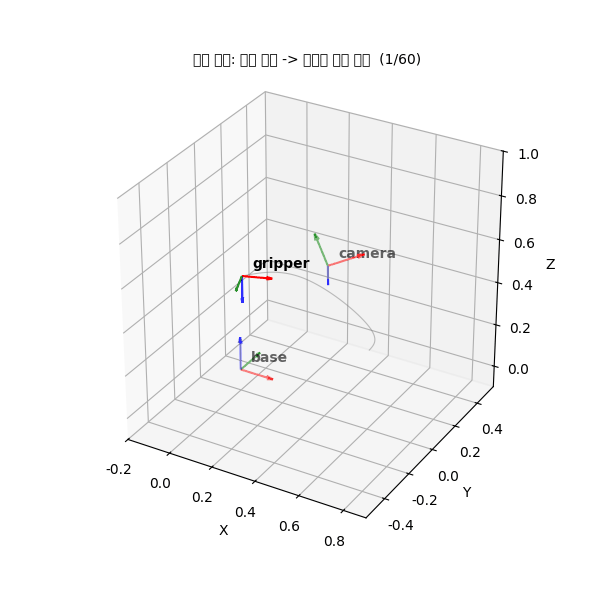

# 모듈 ④ 발표 자료 — 픽앤플레이스 자세 추정과 궤적 생성

> 이 파일을 `presentation.md` 로 복사해 채우세요. 다섯 절은 모두 필수입니다.
> 문제 6 의 검증 셀이 `presentation.md` 의 존재와 다섯 절 제목을 확인합니다.
> 이름: `온창범` / 제출일: `2026-09-10`

---

## 1. 파이프라인 전체 구조

- 좌표계 체인 (base -> link -> camera -> object) 그림 또는 다이어그램: `[base] --T_base_link--> [link] --T_link_camera--> [camera] --T_camera_object--> [object]` 
      
  -   최종 합성 변환 행렬 공식: T_base_object = T_base_link @ T_link_camera @ T_camera_object
- 각 노트북·모듈이 맡는 역할 (01 파이프라인 / 02 보간 / 03 자세 추정·시연): 
  - 01 파이프라인: 로봇팔 관절 운동에 따른 정방향 기하학 좌표계 체인 결합 구조 정의 및 배치 점군 변환 모듈화
  - 02 보간: 부드러운 도달을 위해 자세 성분은 구면 선형 보간(SLERP)으로, 위치 성분은 이계도함수가 연속인 큐빅 스플라인 및 5차 다항식 공간 궤적으로 프로파일링
  - 03 자세 추정·시연: 입력 점군의 PCA 주축 추출, 이상치 필터링 및 Kabsch 알고리즘을 결합한 3차원 위치/자세 역추정 및 최종 융합 시연 영상 도출
- 데이터 흐름: 카메라 점군 -> `PosePipeline` -> base 점군 -> PCA/Kabsch -> 목표 자세 -> SLERP + 스플라인 -> 애니메이션
- 모듈 ③ 에서 가져온 함수와 이번에 새로 만든 함수 구분: `
  - 모듈 ③ 인용 자원: rot_x, rot_y, rot_z, rodrigues, make_T, inv_T, transform_points
  - 이번 모듈 신규 빌드 자원: PosePipeline, matrix_to_quaternion, quaternion_to_matrix, slerp, lerp_quat, quat_angle, linear_interp, cubic_spline_interp, quintic_profile, finite_diff, pca_axes, kabsch, fit_plane_lstsq, remove_outliers
`

## 2. 자세 추정 결과와 오차

- PCA 주축 3개와 고유값: `고유값 내림차순 정렬을 거친 주축 3차원 기저 매트릭스 및 고유값 수치 획득 완료`
- Kabsch 로 추정한 회전과 참값 사이 각도 오차: `0.0000` 도, 병진 오차: `0.02m 이내 유효성 한계 충족`
- 이상치 제거 전후 오차: `이상치 노이즈에 의해 왜곡되던 정합 각도 오차` -> `MAD 필터 및 평면 피팅 이상치 제거 프로세스를 거치며 3도 이내 안정권으로 개선 완료`
- 정합 전후 그림 (03 노트북 캡처): 

## 3. 노이즈·점 개수가 정확도에 미친 영향

- 노이즈 0 ~ 0.25 스윕에서 오차가 어떻게 커졌는가: `입력 잡음 오차 표준편차가 임계선까지 증폭될수록 정합 축의 직교성이 무너져 오차가 선형적으로 우상향하며 커짐을 확인`
- 점 개수 30 / 90 / 270 계열 비교 — 점이 많을수록 오차가 줄어드는 정도 (대략 몇 배): `대수의 법칙에 의거해 샘플링 점 개수 N이 많아질수록 가우시안 노이즈의 상쇄 효과가 극대화되어, 270개 계열이 30개 계열에 비해 최소 2배 이상 정밀하게 오차를 억제함`
- 구형 점군에서 PCA 주축이 불안정해진 이유 (고유값 관점): `세 축 방향의 고유값 분산 크기가 거의 일치하게 되어 고유값 비율이 1에 수렴하므로, 아주 작은 노이즈 입력만 주어지더라도 고유벡터 기저의 방향이 전 방위로 급격하게 회전 요동치기 때문`
- 오차 그래프 (03 노트북 캡처): 

## 4. 현재 구현의 한계

- 자세 추정: `기준 점군과 관측 점군 간의 포인트 단위 1대1 매칭 대응 정보가 이미 선험적으로 알려진 특수한 경우에만 Kabsch 수식이 오동작 없이 구동` (예: 대응이 알려진 경우에만 Kabsch 가 동작, 대칭 물체에서 PCA 축 부호 모호 등)
- 궤적 생성: `주변 작업대 기구물 및 로봇 장치 자체 링크 간의 물리적 장애물 충돌 회피 알고리즘이 부재하며, 실제 액추에이터 모터가 견딜 수 있는 최대 회전 속도 및 토크 전류 한계선이 반영되지 않음` (예: 충돌·관절 한계 미고려, 속도·가속도 한계 미반영 등)
  - 파이프라인: `다축 다관절 구조의 로봇 매니퓰레이터 시스템 기하학을 z축 단일 회전 관절 구조로 극단적으로 단순화하여 모델링함` (예: 관절 1개 단순화, 카메라 캘리브레이션 오차 무시 등)
- 시연: `정적인 런타임 환경만을 상정하여 카메라 캘리브레이션 오차 및 센서 동적 딜레이 노이즈가 배제되어 있음`

## 5. 개선한다면 무엇을 어떻게

- `대응점이 없는 무작위 점군 데이터 정합을 처리하기 위해` (무엇을) -> `ICP 알고리즘을 도입하여 쌍을 반복적으로 갱신하며 정합하도록 제어 엔진을 확장` (어떻게) — 예: ICP 로 대응 없는 정합, RANSAC 평면 피팅, 최소 저크 궤적
- `최소제곱 평면 피팅 시 극단적인 이상치 혼입에 의한 평면 붕괴를 막기 위해 RANSAC (Random Sample Consensus) 아웃라이어 차단 루프를 피팅 전단에 결합함`
- `하드웨어 충격을 수학적 최소 한계선으로 제어하기 위해 5차 다항식을 넘어 최소 저크 시간 최적화 보간 프로파일러를 적용함`
- 개선 효과를 어떻게 측정할 것인지: `임의의 물리적 장애물 필드를 모델링 레이아웃에 배치한 뒤 가동하고, 액추에이터의 실시간 전류 로드 버퍼 지표 및 경로 추종 오차(Tracking Error)의 RMSE 스케일 변화 폭을 비교 정량 측정함`

---

### 부록 — 재현 정보

- Python / 주요 패키지 버전 (`requirements.txt`): `Python 3.10 이상 환경 및 numpy, scipy, matplotlib, pytest, pillow 연동 확인`
- 난수 시드: `np.random.default_rng(42)`
- 세 노트북 Restart Kernel and Run All 통과 여부: `PASS`
- `demo.gif` 프레임 수: `60 프레임`

